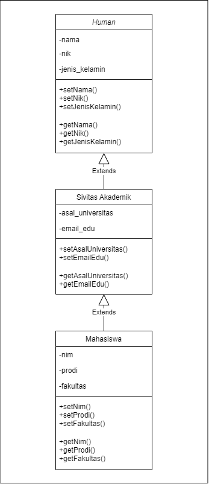

# LATIHAN2DPBO2023
Latihan 2 Praktikum Mata Kuliah Desain dan Pemrograman Berorientasi Objek

Saya Najma Qalbi Dwiharani dengan NIM 2102843 mengerjakan soal Latihan 2 dalam mata kuliah Desain dan Pemrograman Berorientasi Objek untuk keberkahanNya maka saya tidak melakukan kecurangan seperti yang telah dispesifikasikan. Aamiin.

## Desain Program

Desain kelas dalam program ini adalah multi-level inheritance yang dapat digambarkan seperti berikut:

  

Program ini terdiri dari 3 kelas, yaitu:

### 1. Kelas Human
#### Attributes
- NIK
- Nama
- Jenis Kelamin

#### Methods
- Constructor kosong (C++, Java)
- Constructor dengan parameter seluruh atribut kelas
- Setter dan Getter setiap atribut

Kelas ini menjadi kelas parent paling atas dalam inheritance karena kelas-kelas yang lain merupakan jenis/objek yang sama dengan kelas Human ini. Atribut dalam kelas ini juga diperlukan oleh kelas-kelas  lainnya.
 
### 2. Kelas Sivitas Akademik
#### Attributes
- Asal Universitas
- Email Edu

#### Methods
- Constructor kosong (C++, Java)
- Constructor dengan parameter seluruh atribut kelas
- Setter dan Getter setiap atribut

Kelas ini menjadi child dari Human karena satu jenis yaitu sama-sama manusia dan membutuhkan atribut dalam kelas Human. Kelas ini juga menjadi parent dari mahasiswa karena mahasiswa merupakan Human dan Sivitas Akademik sehingga Mahasiswa juga membutuhkan atribut dalam kelas Sivitas Akademik. Kelas Sivitas Akademik juga tidak digabung dengan Mahasiswa karena tidak semua Sivitas Akademik adalah Mahasiswa, masih ada kemungkinan untuk di-expand dengan ditambah kelas Dosen atau Sivitas Akademik lainnya.

### 2. Kelas Mahasiswa
#### Attributes
- NIM
- Prodi
- Fakultas

#### Methods
- Constructor kosong (C++, Java)
- Constructor dengan parameter seluruh atribut kelas
- Setter dan Getter setiap atribut

Kelas ini menjadi child dari kelas Sivitas Akademik dan cucu dari kelas Human karena Mahasiswa merupakan Sivitas Akademik dan Human.

### Program/Kelas Main

Program ini akan menampilkan informasi/atribut terkait dengan Mahasiswa karena Mahasiswa merupakan child paling bawah/cucu. Informasi/atribut akan ditampilkan dalam bentuk tabel/list. Dalam program C++ dan Python user dapat memberikan input data yang kemudian akan ditampilkan, sedangkan dalam program Java dan PHP hanya menampilkan data mahasiswa yang sudah di-hardcode.

## Alur Program

### Input Data Mahasiswa

  
  
  

### Menampilkan Data Mahasiswa

  
  
  

## Dokumentasi

### Java

  

### C++

  

### Python

  

### PHP

  
